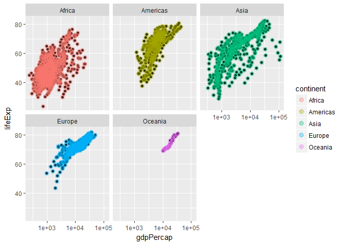

# Stat 545 Lecture Notes
By Jennica Nichols  
September 24, 2017  


# Stat545
These are my personal notes from Stat 545 to help with my.

## Lecture 1 
### Add text to README file
Go to Github and get link to clone. Open using in RStudio and pull to get the latest version. You can then make edits locally, where you then commit changes and then push back to the repository.

## Lecture 2
No notes to add

## Lecture 3
No notes to add

## Lecture 4
### Changing output format
The following YAML formatting at the top for a markdown file will make sure that I keep the md intermediate file.

output:
  html_document:
    keep_md: true  
    
[Here is information on YAML features for Markdown](http://rmarkdown.rstudio.com/html_document_format.html)

[Here is a Markdown Cheatsheet](https://github.com/adam-p/markdown-here/wiki/Markdown-Cheatsheet)

## Lecture 5

The first part of the lecture is to look at working with a dataframe

```r
##number of columns 
ncol(iris)
```

```
## [1] 5
```

```r
##column names
colnames(iris)
```

```
## [1] "Sepal.Length" "Sepal.Width"  "Petal.Length" "Petal.Width" 
## [5] "Species"
```

```r
##number of rows
nrow(iris)
```

```
## [1] 150
```

```r
##smallest values for each numeric variable
summary(iris)
```

```
##   Sepal.Length    Sepal.Width     Petal.Length    Petal.Width   
##  Min.   :4.300   Min.   :2.000   Min.   :1.000   Min.   :0.100  
##  1st Qu.:5.100   1st Qu.:2.800   1st Qu.:1.600   1st Qu.:0.300  
##  Median :5.800   Median :3.000   Median :4.350   Median :1.300  
##  Mean   :5.843   Mean   :3.057   Mean   :3.758   Mean   :1.199  
##  3rd Qu.:6.400   3rd Qu.:3.300   3rd Qu.:5.100   3rd Qu.:1.800  
##  Max.   :7.900   Max.   :4.400   Max.   :6.900   Max.   :2.500  
##        Species  
##  setosa    :50  
##  versicolor:50  
##  virginica :50  
##                 
##                 
## 
```

```r
##make a histogram of Petal.Width
hist(iris$Petal.Width)
```

<!-- -->

The second part of the lecture is to learn the fundamentals of dplyr. The package's primary functions are:

* Pick observations by their values (filter()).
* Pick variables by their names (select()).
* Reorder the rows (arrange()).
* Create new variables with functions of existing variables (mutate()).
* Collapse many values down to a single summary (summarise()).
* Then there’s group_by(), which can be used in conjunction with all of these.


```r
#load libraries
library(dplyr)
```

```
## 
## Attaching package: 'dplyr'
```

```
## The following objects are masked from 'package:stats':
## 
##     filter, lag
```

```
## The following objects are masked from 'package:base':
## 
##     intersect, setdiff, setequal, union
```

```r
library(gapminder)

#use filer
filter(gapminder, country=="Canada")
```

```
## # A tibble: 12 x 6
##    country continent  year lifeExp      pop gdpPercap
##     <fctr>    <fctr> <int>   <dbl>    <int>     <dbl>
##  1  Canada  Americas  1952  68.750 14785584  11367.16
##  2  Canada  Americas  1957  69.960 17010154  12489.95
##  3  Canada  Americas  1962  71.300 18985849  13462.49
##  4  Canada  Americas  1967  72.130 20819767  16076.59
##  5  Canada  Americas  1972  72.880 22284500  18970.57
##  6  Canada  Americas  1977  74.210 23796400  22090.88
##  7  Canada  Americas  1982  75.760 25201900  22898.79
##  8  Canada  Americas  1987  76.860 26549700  26626.52
##  9  Canada  Americas  1992  77.950 28523502  26342.88
## 10  Canada  Americas  1997  78.610 30305843  28954.93
## 11  Canada  Americas  2002  79.770 31902268  33328.97
## 12  Canada  Americas  2007  80.653 33390141  36319.24
```
Relational operators are logical expressions that will give you either a TRUE or FALSE output. 
* a == b means	a is equal to b
* a != b means 	a is not equal to b.
* a > b	means a is greater than b.
* a < b	means a is less than b.
* a >= b	means a is greater than or equal to b.
* a <= b	means a is less than or equal to b.
* a %in% b	means a is an element in b

* a | b means a or b
* a & b means a and b


```r
#testing these out
4 %in% c(1, 2, 3, 4, 5)
```

```
## [1] TRUE
```

```r
## Canada entries before 1970
filter(gapminder, country == "Canada", year <1970)
```

```
## # A tibble: 4 x 6
##   country continent  year lifeExp      pop gdpPercap
##    <fctr>    <fctr> <int>   <dbl>    <int>     <dbl>
## 1  Canada  Americas  1952   68.75 14785584  11367.16
## 2  Canada  Americas  1957   69.96 17010154  12489.95
## 3  Canada  Americas  1962   71.30 18985849  13462.49
## 4  Canada  Americas  1967   72.13 20819767  16076.59
```

```r
## Canada and Kenya entries after 1985
filter(gapminder, country %in% c("Canada", "Kenya"), year>1985)
```

```
## # A tibble: 10 x 6
##    country continent  year lifeExp      pop gdpPercap
##     <fctr>    <fctr> <int>   <dbl>    <int>     <dbl>
##  1  Canada  Americas  1987  76.860 26549700 26626.515
##  2  Canada  Americas  1992  77.950 28523502 26342.884
##  3  Canada  Americas  1997  78.610 30305843 28954.926
##  4  Canada  Americas  2002  79.770 31902268 33328.965
##  5  Canada  Americas  2007  80.653 33390141 36319.235
##  6   Kenya    Africa  1987  59.339 21198082  1361.937
##  7   Kenya    Africa  1992  59.285 25020539  1341.922
##  8   Kenya    Africa  1997  54.407 28263827  1360.485
##  9   Kenya    Africa  2002  50.992 31386842  1287.515
## 10   Kenya    Africa  2007  54.110 35610177  1463.249
```

```r
## Canada and Kenya entries from the 1960s
filter(gapminder, country %in% c("Canada", "Kenya"), year %in% 1960:1969)
```

```
## # A tibble: 4 x 6
##   country continent  year lifeExp      pop  gdpPercap
##    <fctr>    <fctr> <int>   <dbl>    <int>      <dbl>
## 1  Canada  Americas  1962  71.300 18985849 13462.4855
## 2  Canada  Americas  1967  72.130 20819767 16076.5880
## 3   Kenya    Africa  1962  47.949  8678557   896.9664
## 4   Kenya    Africa  1967  50.654 10191512  1056.7365
```

```r
## Select only continent and country rows
select(gapminder, continent, country)
```

```
## # A tibble: 1,704 x 2
##    continent     country
##       <fctr>      <fctr>
##  1      Asia Afghanistan
##  2      Asia Afghanistan
##  3      Asia Afghanistan
##  4      Asia Afghanistan
##  5      Asia Afghanistan
##  6      Asia Afghanistan
##  7      Asia Afghanistan
##  8      Asia Afghanistan
##  9      Asia Afghanistan
## 10      Asia Afghanistan
## # ... with 1,694 more rows
```
Next is testing piping, which is where you chain together functions to run code efficiently. 


```r
#Select country, year, and GDP per capita for Canada and Kenya entries in the 1960s
gapminder %>%
  filter(country %in% c("Canada", "Kenya"), year %in%
           1960:1969) %>%
  select(country, year, gdpPercap)
```

```
## # A tibble: 4 x 3
##   country  year  gdpPercap
##    <fctr> <int>      <dbl>
## 1  Canada  1962 13462.4855
## 2  Canada  1967 16076.5880
## 3   Kenya  1962   896.9664
## 4   Kenya  1967  1056.7365
```

```r
#Take all countries in Europe that have a GPD per capita greater than 10000, and select all variables except gdpPercap
gapminder %>%
  filter(continent=="Europe", gdpPercap>10000) %>%
  select(-gdpPercap)
```

```
## # A tibble: 214 x 5
##    country continent  year lifeExp     pop
##     <fctr>    <fctr> <int>   <dbl>   <int>
##  1 Austria    Europe  1962  69.540 7129864
##  2 Austria    Europe  1967  70.140 7376998
##  3 Austria    Europe  1972  70.630 7544201
##  4 Austria    Europe  1977  72.170 7568430
##  5 Austria    Europe  1982  73.180 7574613
##  6 Austria    Europe  1987  74.940 7578903
##  7 Austria    Europe  1992  76.040 7914969
##  8 Austria    Europe  1997  77.510 8069876
##  9 Austria    Europe  2002  78.980 8148312
## 10 Austria    Europe  2007  79.829 8199783
## # ... with 204 more rows
```

```r
#Order the data frame by year, then descending by life expectancy. Rearrange data frame so year comes first then life expectancy
gapminder %>%
  arrange(pop, desc(lifeExp)) %>%
  select(year, lifeExp, everything())
```

```
## # A tibble: 1,704 x 6
##     year lifeExp               country continent   pop gdpPercap
##    <int>   <dbl>                <fctr>    <fctr> <int>     <dbl>
##  1  1952  46.471 Sao Tome and Principe    Africa 60011  879.5836
##  2  1957  48.945 Sao Tome and Principe    Africa 61325  860.7369
##  3  1952  34.812              Djibouti    Africa 63149 2669.5295
##  4  1962  51.893 Sao Tome and Principe    Africa 65345 1071.5511
##  5  1967  54.425 Sao Tome and Principe    Africa 70787 1384.8406
##  6  1957  37.328              Djibouti    Africa 71851 2864.9691
##  7  1972  56.480 Sao Tome and Principe    Africa 76595 1532.9853
##  8  1977  58.550 Sao Tome and Principe    Africa 86796 1737.5617
##  9  1962  39.693              Djibouti    Africa 89898 3020.9893
## 10  1982  60.351 Sao Tome and Principe    Africa 98593 1890.2181
## # ... with 1,694 more rows
```

You can use mutate to create new variables that are calculated from other variables within the data frame. 

```r
mutate(gapminder, 
       gdp = gdpPercap * pop, 
       gdpBill = round(gdp/1000000000, 1))
```

```
## # A tibble: 1,704 x 8
##        country continent  year lifeExp      pop gdpPercap         gdp
##         <fctr>    <fctr> <int>   <dbl>    <int>     <dbl>       <dbl>
##  1 Afghanistan      Asia  1952  28.801  8425333  779.4453  6567086330
##  2 Afghanistan      Asia  1957  30.332  9240934  820.8530  7585448670
##  3 Afghanistan      Asia  1962  31.997 10267083  853.1007  8758855797
##  4 Afghanistan      Asia  1967  34.020 11537966  836.1971  9648014150
##  5 Afghanistan      Asia  1972  36.088 13079460  739.9811  9678553274
##  6 Afghanistan      Asia  1977  38.438 14880372  786.1134 11697659231
##  7 Afghanistan      Asia  1982  39.854 12881816  978.0114 12598563401
##  8 Afghanistan      Asia  1987  40.822 13867957  852.3959 11820990309
##  9 Afghanistan      Asia  1992  41.674 16317921  649.3414 10595901589
## 10 Afghanistan      Asia  1997  41.763 22227415  635.3414 14121995875
## # ... with 1,694 more rows, and 1 more variables: gdpBill <dbl>
```

Summarize reduces the tibble to summary statistics, which is very useful when used with group_by

```r
gapminder %>% 
    group_by(country) %>% 
    summarize(mean_pop=mean(pop), sd_pop=sd(pop))
```

```
## # A tibble: 142 x 3
##        country   mean_pop     sd_pop
##         <fctr>      <dbl>      <dbl>
##  1 Afghanistan 15823715.4  7114583.5
##  2     Albania  2580249.2   828585.5
##  3     Algeria 19875406.2  8613355.3
##  4      Angola  7309390.1  2672280.6
##  5   Argentina 28602239.9  7546609.0
##  6   Australia 14649312.5  3915203.0
##  7     Austria  7583298.4   437660.0
##  8     Bahrain   373913.2   210893.3
##  9  Bangladesh 90755395.3 34711660.7
## 10     Belgium  9725118.7   520635.9
## # ... with 132 more rows
```

```r
#Find the minimum GDP per capita experienced by each country
gapminder %>%
  group_by(country) %>%
  summarize(minGDP = min(gdpPercap))
```

```
## # A tibble: 142 x 2
##        country     minGDP
##         <fctr>      <dbl>
##  1 Afghanistan   635.3414
##  2     Albania  1601.0561
##  3     Algeria  2449.0082
##  4      Angola  2277.1409
##  5   Argentina  5911.3151
##  6   Australia 10039.5956
##  7     Austria  6137.0765
##  8     Bahrain  9867.0848
##  9  Bangladesh   630.2336
## 10     Belgium  8343.1051
## # ... with 132 more rows
```

```r
#Find how many years of records does each country have
gapminder %>%
  group_by(country) %>%
  summarize(n_distinct(year))
```

```
## # A tibble: 142 x 2
##        country `n_distinct(year)`
##         <fctr>              <int>
##  1 Afghanistan                 12
##  2     Albania                 12
##  3     Algeria                 12
##  4      Angola                 12
##  5   Argentina                 12
##  6   Australia                 12
##  7     Austria                 12
##  8     Bahrain                 12
##  9  Bangladesh                 12
## 10     Belgium                 12
## # ... with 132 more rows
```

```r
#Within Asia, what are the min and max life expectancies experienced in each year?
gapminder %>% 
    filter(continent=="Asia") %>% 
    group_by(year) %>% 
    summarize(minexp=min(lifeExp),
              maxexp=max(lifeExp))
```

```
## # A tibble: 12 x 3
##     year minexp maxexp
##    <int>  <dbl>  <dbl>
##  1  1952 28.801 65.390
##  2  1957 30.332 67.840
##  3  1962 31.997 69.390
##  4  1967 34.020 71.430
##  5  1972 36.088 73.420
##  6  1977 31.220 75.380
##  7  1982 39.854 77.110
##  8  1987 40.822 78.670
##  9  1992 41.674 79.360
## 10  1997 41.763 80.690
## 11  2002 42.129 82.000
## 12  2007 43.828 82.603
```
If want additional introduction to dplyr, 
*[Stats 545 Intro Part 1](http://stat545.com/block009_dplyr-intro.html)
*[Stats 545 Intro Part 2](http://stat545.com/block010_dplyr-end-single-table.html)

# Lecture 6
This lecture is about ggplot2. 


```r
#load library
library(ggplot2)
library(gapminder)

#create first layer that contains dataset and an indication of what variables will go to what scale
p <- ggplot(gapminder, aes(x=year, y=lifeExp))

#this is blank as you need to layer on points and asthetics which is done using a "+"
p + geom_point(alpha=0.25)
```

<!-- -->

```r
#make a scatterplot of GDP per capita and life expectancy
p2 <- ggplot(gapminder, aes(x=gdpPercap, y=lifeExp))
p2+ geom_point(aes(size=year, color=continent, alpha=1/20))
```

<!-- -->

```r
#log transformation
p3 <- p2 + geom_point() + scale_x_log10()

#Colour log transformation by continent and set transparency and size
p4 <- p3 + geom_point(aes(color = continent), alpha=(1/3), size=3)

#Add a smooth line without standard error and using lm
p4 + geom_smooth(method=lm, se = FALSE)
```

<!-- -->

```r
#Take advantage of facetting (factoring)
p4 + facet_wrap(~continent)
```

<!-- -->

```r
##subsetting: looking at 4 countries
jCountries <- c("Canada", "Kenya", "France", "India")

ggplot(subset(gapminder, country %in% jCountries),
       aes(x = year, y = lifeExp, color= country)) + geom_line() +   geom_point()
```

<!-- -->

```r
#Make a plot of year (x) vs lifeExp (y), with points coloured by continent. Then, fit a regression line to each continent, without the error bars. If you can, try piping the data frame into the ggplot function
q <- ggplot(gapminder, aes(x=year, y=lifeExp, color=continent))

q + geom_point()+ geom_smooth(method=lm, se = FALSE)
```

<!-- -->

```r
##Make a plot of year (x) vs lifeExp (y), facetted by continent. Then, fit a smoother through the data for each continent, without the error bars. Choose a span that you feel is appropriate.
q + geom_point()+ geom_smooth(method=lm, se = FALSE) + facet_wrap(~continent)
```

<!-- -->

```r
##Plot the population over time (year) using lines, so that each country has its own line. Add alpha transparency to your liking.Add points to the plot in Exercise 7.
r <- ggplot(gapminder, aes(x=year, y=pop, group=country))
r + geom_line(alpha=1/3) 
```

<!-- -->

```r
r2 <-r + geom_line(alpha=1/3)
r2 + geom_point() 
```

<!-- -->

#  Lecture 7

```r
# Regression curves
# Regression analysis fits some curve through the data, representing the mean of Y given the specified X value. Sometimes you assume a line (linear model) or can apply a general curve (i.e. a smoother)

vc1 <- ggplot(gapminder, aes(year, lifeExp)) +
    geom_point() 
vc1 + geom_smooth(se=FALSE)
```

```
## `geom_smooth()` using method = 'gam'
```

<!-- -->

```r
# Exercise 1: Make a plot of year (x) vs lifeExp (y), with points coloured by continent. Then, to that same plot, fit a straight regression line to each continent, without the error bars. If you can, try piping the data frame into the ggplot function

ggplot(gapminder, aes(year, lifeExp, colour=continent)) +
  geom_point() +  # need this to show points on graph
  geom_smooth(method= "lm", se=FALSE)
```

<!-- -->

```r
# Facetting separates data from each group into its own “mini plot”, called a panel. These panels are arranged next to each otherfor easier comparison. There are two facetting functions in ggplot2: (1) facet_wrap: 1D facetting and (2) facet_grid: 2D facetting. Example of (1):

ggplot(gapminder, aes(gdpPercap, lifeExp)) +
    facet_wrap(~ continent) +
    geom_point()
```

<!-- -->

```r
# Exercise 2: Make a plot of year (x) vs lifeExp (y), facetted by continent. Then, fit a smoother through the data for each continent, without the error bars. Choose a span that you feel is appropriate. NOTE: A small span results in a more jagged curve; a larger one results in a smoother curve. You have to find one that fits your data

ggplot(gapminder, aes(year, lifeExp)) +
  geom_point() +
  facet_wrap(~continent)+
  geom_smooth(method = "lm", se=FALSE, span=1)
```

<!-- -->

```r
# Facet_grid allows you to add a third variable so each row corresponds to one grouping and each column corresponds to another grouping. facet_grid(var 1~ var 2) Example 3: Look at continent and population size by “small” (<=7,000,000 population) and “large” (>7,000,000 population) countries. 

vc2 <- gapminder %>% 
    mutate(size=ifelse(pop > 7000000, "large", "small")) %>%     ggplot(aes(gdpPercap, lifeExp)) +
    facet_grid(size ~ continent) 

vc2 + geom_point(aes(colour=year))
```

<!-- -->

```r
# Connect the dots with geom_line (connect dots left-to-right) or geom_path (conects dots in the order they appear within the data frame). With these geoms, you must specify group=VARIABLE in your aesthetics (aes function), otherwise ggplot won’t distinguish between groups. Example:
ggplot(gapminder, aes(year, lifeExp, group=country)) +
    geom_line(alpha=0.2)
```

<!-- -->

```r
# geom_path is typically used when a “time” variable is not shown on an axis. For example, let’s look at a scatterplot of pop vs. gdpPercap of Afghanistan, and let’s “connect the dots” in the order of time. Example:

gapminder %>%
    filter(country=="Afghanistan") %>% 
    arrange(year) %>% 
    ggplot(aes(pop, gdpPercap)) +
    geom_point() +
    geom_path()
```

<!-- -->

```r
# Example 4:  Plot the population over time (year) using lines, so that each country has its own line. Colour by  gdpPercap. Add alpha transparency to your liking. Fit it to a log 10 scale.

##remember group is essential for this!

ggplot(gapminder, aes(year, pop, group=country)) + 
  geom_line(aes(colour=gdpPercap), alpha=0.2) +
  geom_point() +
  scale_y_log10()
```

<!-- -->

# Lecture 8
## Modeling
First we will look at linear regression using the **lm()** function.

```r
# create a linear model
fit1 <- lm(lifeExp ~ log(gdpPercap), data=gapminder)
fit1
```

```
## 
## Call:
## lm(formula = lifeExp ~ log(gdpPercap), data = gapminder)
## 
## Coefficients:
##    (Intercept)  log(gdpPercap)  
##         -9.101           8.405
```

```r
# can make predictions using the model. Remember if you don’t specify new data, it will make predictions using the existing X values.
predict(fit1) %>% head
```

```
##        1        2        3        4        5        6 
## 46.86506 47.30012 47.62400 47.45579 46.42835 46.93666
```

```r
# can plot again the original x values
qplot(log(gapminder$gdpPercap), predict(fit1))
```

<!-- -->

```r
# can predict with new data as long as the data frame has the same column names as the x values.
(my_newdata <- data.frame(gdpPercap=c(100, 547, 289)))
```

```
##   gdpPercap
## 1       100
## 2       547
## 3       289
```

```r
predict(fit1, newdata=my_newdata)
```

```
##        1        2        3 
## 29.60596 43.88854 38.52591
```

```r
predict(fit1, newdata=filter(gapminder, country=="Canada"))
```

```
##        1        2        3        4        5        6        7        8 
## 69.38986 70.18158 70.81182 72.30336 73.69461 74.97451 75.27641 76.54409 
##        9       10       11       12 
## 76.45408 77.24871 78.43120 79.15337
```

```r
# can extract model characteristics
  #model coefficients
  coef(fit1)
```

```
##    (Intercept) log(gdpPercap) 
##      -9.100889       8.405085
```

```r
  #residuals (looking at the first 6 and then plotting all)
  resid(fit1) %>% head
```

```
##          1          2          3          4          5          6 
## -18.064063 -16.968123 -15.627000 -13.435788 -10.340352  -8.498661
```

```r
  qplot(log(gapminder$gdpPercap), resid(fit1)) +
    geom_hline(yintercept=0, linetype="dashed", colour="red")
```

<!-- -->

```r
  #lots of information can be determined using summary, such as p-values and standard errors
  summary(fit1)
```

```
## 
## Call:
## lm(formula = lifeExp ~ log(gdpPercap), data = gapminder)
## 
## Residuals:
##     Min      1Q  Median      3Q     Max 
## -32.778  -4.204   1.212   4.658  19.285 
## 
## Coefficients:
##                Estimate Std. Error t value Pr(>|t|)    
## (Intercept)     -9.1009     1.2277  -7.413 1.93e-13 ***
## log(gdpPercap)   8.4051     0.1488  56.500  < 2e-16 ***
## ---
## Signif. codes:  0 '***' 0.001 '**' 0.01 '*' 0.05 '.' 0.1 ' ' 1
## 
## Residual standard error: 7.62 on 1702 degrees of freedom
## Multiple R-squared:  0.6522,	Adjusted R-squared:  0.652 
## F-statistic:  3192 on 1 and 1702 DF,  p-value: < 2.2e-16
```

```r
  #can extract specifics from the summary
  sum1 <- summary(fit1)
  
    #r-squared and r-square adjusted
    sum1$r.square
```

```
## [1] 0.6522466
```

```r
    sum1$adj.r.squared
```

```
## [1] 0.6520423
```

```r
    #estimated standard deviation of the random error term
    sum1$sigma
```

```
## [1] 7.619535
```

###Other Models:
1.  generalized linear models (such as logistic regression). For this, you use the **glm()** function. It is quite similar to lm, except you need to specify what model to run using the family argument. Syntax includes:

    * Poisson regression:
glm(y ~ x1 + x2 + ... + xp, family=poisson, data=your_data_frame)

    * Logistic (aka Binomial) regression:
glm(y ~ x1 + x2 + ... + xp, family=binomial, data=your_data_frame)

2. Generalized) Mixed Effects Models:
Two R packages are available: lme4 and nlme.
Check out [this](https://stats.stackexchange.com/questions/5344/how-to-choose-nlme-or-lme4-r-library-for-mixed-effects-models) discussion for a comparison of the two packages.

3. Kernel smoothing (i.e. fitting a “smoother”):
Check out the loess function.

4. Generalized Additive Models:
The gam function in either the gam package or mgcv package.

5. Robust linear regression: 
The rlm function in the MASS package is your friend

## More dplyr
One of the most powerful functions is using **mutate()** with grouped tibble. 

```r
# Exercise 1: Calculate the growth in population since the first year on record for each country
gapminder %>%
  group_by(country) %>%
  mutate(pop_growth = pop-pop[1])
```

```
## # A tibble: 1,704 x 7
## # Groups:   country [142]
##        country continent  year lifeExp      pop gdpPercap pop_growth
##         <fctr>    <fctr> <int>   <dbl>    <int>     <dbl>      <int>
##  1 Afghanistan      Asia  1952  28.801  8425333  779.4453          0
##  2 Afghanistan      Asia  1957  30.332  9240934  820.8530     815601
##  3 Afghanistan      Asia  1962  31.997 10267083  853.1007    1841750
##  4 Afghanistan      Asia  1967  34.020 11537966  836.1971    3112633
##  5 Afghanistan      Asia  1972  36.088 13079460  739.9811    4654127
##  6 Afghanistan      Asia  1977  38.438 14880372  786.1134    6455039
##  7 Afghanistan      Asia  1982  39.854 12881816  978.0114    4456483
##  8 Afghanistan      Asia  1987  40.822 13867957  852.3959    5442624
##  9 Afghanistan      Asia  1992  41.674 16317921  649.3414    7892588
## 10 Afghanistan      Asia  1997  41.763 22227415  635.3414   13802082
## # ... with 1,694 more rows
```

```r
# What about growth compared to 1972?
gapminder %>%
  group_by(country) %>%
  mutate(pop_growth = pop-pop[year==1972])
```

```
## # A tibble: 1,704 x 7
## # Groups:   country [142]
##        country continent  year lifeExp      pop gdpPercap pop_growth
##         <fctr>    <fctr> <int>   <dbl>    <int>     <dbl>      <int>
##  1 Afghanistan      Asia  1952  28.801  8425333  779.4453   -4654127
##  2 Afghanistan      Asia  1957  30.332  9240934  820.8530   -3838526
##  3 Afghanistan      Asia  1962  31.997 10267083  853.1007   -2812377
##  4 Afghanistan      Asia  1967  34.020 11537966  836.1971   -1541494
##  5 Afghanistan      Asia  1972  36.088 13079460  739.9811          0
##  6 Afghanistan      Asia  1977  38.438 14880372  786.1134    1800912
##  7 Afghanistan      Asia  1982  39.854 12881816  978.0114    -197644
##  8 Afghanistan      Asia  1987  40.822 13867957  852.3959     788497
##  9 Afghanistan      Asia  1992  41.674 16317921  649.3414    3238461
## 10 Afghanistan      Asia  1997  41.763 22227415  635.3414    9147955
## # ... with 1,694 more rows
```

* Vectorized Functions: These take a vector, and operate on each component independently to return a vector of the same length. In other words, they work element-wise.
    * Examples are cos, sin, log, exp, round.
    * We don’t need to group_by in order to mutate with these.

*Aggregate Functions: These take a vector, and return a vector of length 1 – as if “aggregating” the values in the vector into a single value.
    * Examples are mean, sd, length, typeof.
    * We use these in dplyr’s summarise function.

* Window Functions: these take a vector, and return a vector of the same length that depends on other values in the vector.
    * Examples are lag, rank, cumsum.
    * See the window-functions vignette for the dplyr package.

## More ggplot
* The [ggplot2 cheatsheet](https://www.rstudio.com/wp-content/uploads/2015/03/ggplot2-cheatsheet.pdf) is very helpful for data visualization. 

1. Themes
You can change the look of the plot (e.g. font, justification of title, line thickness) using existing themes. There are complete themes already created, which you can see [here](http://ggplot2.tidyverse.org/reference/ggtheme.html). 

```r
# An example of using the theme_bw theme
p1 <- ggplot(gapminder, aes(gdpPercap, lifeExp)) +
    facet_wrap(~ continent) +
    geom_point(colour="#386CB0", alpha=0.2) +
    scale_x_log10()
p1 + theme_bw()
```

<!-- -->
You can modify theme elements by selecting an argument  name (e.g. axis.title, strip.text) and then specifying the value using one of these functions:
* element_blank: leave things as is
* element_rect: change features of a rectangle
* element_line: change features of a line
* element_text: change fonts


```r
# For example, change the strip background to orange as well as increase font size to 14 and bold panel titles
p1 +
  theme_bw() +  # before modifications or overrides changes
    theme(strip.background = element_rect(fill="orange"),
          axis.title = element_text(size=14),
          strip.text = element_text(size=14, face="bold"))
```

<!-- -->
2. Modifying scales
Scales control the mapping from data to aesthetics. They take your data and turn it into something that you can see, like size, colour, position or shape. Scales also provide the tools that let you read the plot: the axes and legends. Formally, each scale is a function from a region in data space (the domain of the scale) to a region in aesthetic space (the range of the scale). Go [here](https://github.com/hadley/ggplot2-book/blob/master/scales.rmd) for a lesson.

We can modify scales using a suite of functions that have the following naming convention: scale_a_b, where:
* a is the scale you want to change (e.g. colour, size).
* b typically speaks to the nature of the variable (e.g. continuous, discrete, log10).
* Examples: scale_x_continuous, scale_colour_discrete, scale_y_sqrt.
* These are added as layers

**Useful Arguments**
1. name: The first argument. Indicate the name of the scale/legend here. Can also use labs().

```r
# Examples
p1 + scale_y_continuous("Life Expectancy")
```

<!-- -->

```r
p1 + labs(x="GDP per capita", 
          y="Life Expectancy",
          title="My Plot")
```

<!-- -->

```r
ggplot(gapminder, aes(gdpPercap, lifeExp)) +
    geom_point(aes(colour=continent),
               alpha=0.2) +
    scale_colour_discrete("Continents of\n the World")
```

<!-- -->

2. breaks: you get to specify where along the scale you'd like to display a value for continuous data. Numbers are on the scale of the data (such as population).

```r
# Example
## Log lines:
p1 + scale_x_log10(breaks=c((1:10)*1000,
                            (1:10)*10000))
```

```
## Scale for 'x' is already present. Adding another scale for 'x', which
## will replace the existing scale.
```

<!-- -->

```r
p2 <- ggplot(gapminder, aes(gdpPercap, lifeExp)) +
    geom_point(aes(colour=pop/10^9),
               alpha=0.2)

## Default breaks
p2 + scale_colour_continuous("Population\nin billions")
```

<!-- -->

```r
## New breaks
p2 + scale_colour_continuous("Population\nin billions",
                             breaks=seq(0,2,by=0.2))
```

<!-- -->
3. Labels
Text to replace the data value labels. Most useful for discrete data.

```r
# Example
ggplot(gapminder, aes(gdpPercap, lifeExp)) +
    geom_point(aes(colour=continent), alpha=0.2) +
    scale_colour_discrete(labels=c("Af", "Am", "As", "Eu", "Oc"))
```

<!-- -->

4. Limits
Lower and upper bounds of the data that you'd like displayed. Leave one as NA if you want to use the default.

```r
p1 + scale_y_continuous(limits=c(60,NA))
```

```
## Warning: Removed 827 rows containing missing values (geom_point).
```

<!-- -->

5. Position
Position of the scale. Also controllable using theme for the legend.

```r
p1 + scale_y_continuous(position="right")
```

<!-- -->

```r
p2 + theme(legend.position = "bottom")
```

<!-- -->

## Exercises
Practice what was learned above. 

1. Suppose we want to calculate some quantity for each country in the gapminder data set. For each of the following quantities, indicate whether the function is vectorized, aggregate, or window, and use dplyr functions to calculate the specified variable.
    a) The change in population from 1962 to 1972.
    

```r
## aggregrate
gapminder %>%
  group_by(country) %>%
  summarize(pop_change = pop[year==1972]-pop[year==1962])
```

```
## # A tibble: 142 x 2
##        country pop_change
##         <fctr>      <int>
##  1 Afghanistan    2812377
##  2     Albania     535417
##  3     Algeria    3759839
##  4      Angola    1068843
##  5   Argentina    3496016
##  6   Australia    2382032
##  7     Austria     414337
##  8     Bahrain      58937
##  9  Bangladesh   13920006
## 10     Belgium     490700
## # ... with 132 more rows
```

    b) Population in Billions

```r
## vectorize
gapminder %>%
  group_by(country) %>%
  mutate(pop_billion = pop/10^9)
```

```
## # A tibble: 1,704 x 7
## # Groups:   country [142]
##        country continent  year lifeExp      pop gdpPercap pop_billion
##         <fctr>    <fctr> <int>   <dbl>    <int>     <dbl>       <dbl>
##  1 Afghanistan      Asia  1952  28.801  8425333  779.4453 0.008425333
##  2 Afghanistan      Asia  1957  30.332  9240934  820.8530 0.009240934
##  3 Afghanistan      Asia  1962  31.997 10267083  853.1007 0.010267083
##  4 Afghanistan      Asia  1967  34.020 11537966  836.1971 0.011537966
##  5 Afghanistan      Asia  1972  36.088 13079460  739.9811 0.013079460
##  6 Afghanistan      Asia  1977  38.438 14880372  786.1134 0.014880372
##  7 Afghanistan      Asia  1982  39.854 12881816  978.0114 0.012881816
##  8 Afghanistan      Asia  1987  40.822 13867957  852.3959 0.013867957
##  9 Afghanistan      Asia  1992  41.674 16317921  649.3414 0.016317921
## 10 Afghanistan      Asia  1997  41.763 22227415  635.3414 0.022227415
## # ... with 1,694 more rows
```

    c) Lagged gdpPercap

```r
## window
gapminder %>% 
    group_by(country) %>% 
    arrange(year) %>% 
    mutate(lag_gdpPercap=lag(gdpPercap)) %>% 
    filter(!is.na(lag_gdpPercap))
```

```
## # A tibble: 1,562 x 7
## # Groups:   country [142]
##        country continent  year lifeExp      pop  gdpPercap lag_gdpPercap
##         <fctr>    <fctr> <int>   <dbl>    <int>      <dbl>         <dbl>
##  1 Afghanistan      Asia  1957  30.332  9240934   820.8530      779.4453
##  2     Albania    Europe  1957  59.280  1476505  1942.2842     1601.0561
##  3     Algeria    Africa  1957  45.685 10270856  3013.9760     2449.0082
##  4      Angola    Africa  1957  31.999  4561361  3827.9405     3520.6103
##  5   Argentina  Americas  1957  64.399 19610538  6856.8562     5911.3151
##  6   Australia   Oceania  1957  70.330  9712569 10949.6496    10039.5956
##  7     Austria    Europe  1957  67.480  6965860  8842.5980     6137.0765
##  8     Bahrain      Asia  1957  53.832   138655 11635.7995     9867.0848
##  9  Bangladesh      Asia  1957  39.348 51365468   661.6375      684.2442
## 10     Belgium    Europe  1957  69.240  8989111  9714.9606     8343.1051
## # ... with 1,552 more rows
```

2. For the gapminder dataset, make a spaghetti plot showing the population trend (in millions) over time for each country, facetted by continent. Make as many of the following modifications as you can:

*Colour each line by the log maximum gdpPercap experienced by the country.
*Rotate the x-axis labels to be vertical.
*Remove the x-axis title.
*Give the legend an appropriate title.
*Put the y-axis on a log-scale.
*Rename the y-axis title.
*Add more numbers along the y-axis.
*Give the plot a title, and center the title.
*Only label the x axis with years 1950, 1975, and 2000.
*Move the colour scale to the bottom.
*Rename the colour legend


```r
gapminder %>%
  group_by(country) %>%
  mutate(pop_mill = pop/10^6, max_gdpPercap = max(gdpPercap)) %>%
  ggplot(aes(year, pop_mill)) +
    facet_wrap(~ continent) +
    geom_line(aes(group=country, colour=log(max_gdpPercap)), alpha=0.6) +
  theme_bw() +
  labs(title="Population Trends by Country over Time") +
  scale_y_log10( "Population (millions)",
                 breaks=c(0.1, 1, 10, 100, 1000),
                labels=c(0.1, 1, 10, 100, 1000)) +
  scale_x_continuous("", breaks=c(1950, 1975, 2000)) +
  scale_colour_continuous("log Max\nGDP per capita") +
  theme(axis.text.x = element_text(angle=90),
          plot.title = element_text(hjust=0.5),
          legend.position = "bottom")
```

<!-- -->

# Lecture 9
It’s rare that a data analysis involves only a single table of data. In practice, you’ll normally have many tables that contribute to an analysis, and you need flexible tools to combine them. In dplyr, there are three families of verbs that work with two tables at a time (see below). All work similarly: the first two arguments are x and y, and provide the tables to combine. The output is always a new table with the same type as x.

1. **Mutating Joins**, which add new variables to one table from matching rows in another.

```r
#load library
library("nycflights13") 
  #data saved as seveeral data sets automatically: flights, airlines, planes, weather 

##Basic Join:
# Drop unimportant variables so it's easier to understand the join results.
flights2 <- flights %>% select(year:day, hour, origin, dest, tailnum, carrier)

#join by carrier
flights2 %>% 
  left_join(airlines)
```

```
## # A tibble: 336,776 x 9
##     year month   day  hour origin  dest tailnum carrier
##    <int> <int> <int> <dbl>  <chr> <chr>   <chr>   <chr>
##  1  2013     1     1     5    EWR   IAH  N14228      UA
##  2  2013     1     1     5    LGA   IAH  N24211      UA
##  3  2013     1     1     5    JFK   MIA  N619AA      AA
##  4  2013     1     1     5    JFK   BQN  N804JB      B6
##  5  2013     1     1     6    LGA   ATL  N668DN      DL
##  6  2013     1     1     5    EWR   ORD  N39463      UA
##  7  2013     1     1     6    EWR   FLL  N516JB      B6
##  8  2013     1     1     6    LGA   IAD  N829AS      EV
##  9  2013     1     1     6    JFK   MCO  N593JB      B6
## 10  2013     1     1     6    LGA   ORD  N3ALAA      AA
## # ... with 336,766 more rows, and 1 more variables: name <chr>
```
Each mutating join takes an argument **by** that controls which variables are used to match observations in the two tables. There are a few ways to specify it:
* by=NULL, dplyr will will use all variables that appear in both tables, a natural join.

```r
# the flights and weather tables match on their common variables: year, month, day, hour and origin
flights2 %>% left_join(weather)
```

```
## Joining, by = c("year", "month", "day", "hour", "origin")
```

```
## # A tibble: 336,776 x 18
##     year month   day  hour origin  dest tailnum carrier  temp  dewp humid
##    <dbl> <dbl> <int> <dbl>  <chr> <chr>   <chr>   <chr> <dbl> <dbl> <dbl>
##  1  2013     1     1     5    EWR   IAH  N14228      UA    NA    NA    NA
##  2  2013     1     1     5    LGA   IAH  N24211      UA    NA    NA    NA
##  3  2013     1     1     5    JFK   MIA  N619AA      AA    NA    NA    NA
##  4  2013     1     1     5    JFK   BQN  N804JB      B6    NA    NA    NA
##  5  2013     1     1     6    LGA   ATL  N668DN      DL 39.92 26.06 57.33
##  6  2013     1     1     5    EWR   ORD  N39463      UA    NA    NA    NA
##  7  2013     1     1     6    EWR   FLL  N516JB      B6 39.02 26.06 59.37
##  8  2013     1     1     6    LGA   IAD  N829AS      EV 39.92 26.06 57.33
##  9  2013     1     1     6    JFK   MCO  N593JB      B6 39.02 26.06 59.37
## 10  2013     1     1     6    LGA   ORD  N3ALAA      AA 39.92 26.06 57.33
## # ... with 336,766 more rows, and 7 more variables: wind_dir <dbl>,
## #   wind_speed <dbl>, wind_gust <dbl>, precip <dbl>, pressure <dbl>,
## #   visib <dbl>, time_hour <dttm>
```

* by="x", join is controlled by a character vector

```r
# flights and planes have year columns, but they mean different things so we only want to join by tailnum. 
flights2 %>% left_join(planes, by = "tailnum")
```

```
## # A tibble: 336,776 x 16
##    year.x month   day  hour origin  dest tailnum carrier year.y
##     <int> <int> <int> <dbl>  <chr> <chr>   <chr>   <chr>  <int>
##  1   2013     1     1     5    EWR   IAH  N14228      UA   1999
##  2   2013     1     1     5    LGA   IAH  N24211      UA   1998
##  3   2013     1     1     5    JFK   MIA  N619AA      AA   1990
##  4   2013     1     1     5    JFK   BQN  N804JB      B6   2012
##  5   2013     1     1     6    LGA   ATL  N668DN      DL   1991
##  6   2013     1     1     5    EWR   ORD  N39463      UA   2012
##  7   2013     1     1     6    EWR   FLL  N516JB      B6   2000
##  8   2013     1     1     6    LGA   IAD  N829AS      EV   1998
##  9   2013     1     1     6    JFK   MCO  N593JB      B6   2004
## 10   2013     1     1     6    LGA   ORD  N3ALAA      AA     NA
## # ... with 336,766 more rows, and 7 more variables: type <chr>,
## #   manufacturer <chr>, model <chr>, engines <int>, seats <int>,
## #   speed <int>, engine <chr>
```

* by = c("x" = "a"), join is controlled by a named character vector. This will match variable *x* in table x to variable *a* in table a. The variables from use will be used in the output.

```r
# Each flight has an origin and destination airport, so we need to specify which one we want to join to
flights2 %>% left_join(airports, c("dest" = "faa"))
```

```
## # A tibble: 336,776 x 15
##     year month   day  hour origin  dest tailnum carrier
##    <int> <int> <int> <dbl>  <chr> <chr>   <chr>   <chr>
##  1  2013     1     1     5    EWR   IAH  N14228      UA
##  2  2013     1     1     5    LGA   IAH  N24211      UA
##  3  2013     1     1     5    JFK   MIA  N619AA      AA
##  4  2013     1     1     5    JFK   BQN  N804JB      B6
##  5  2013     1     1     6    LGA   ATL  N668DN      DL
##  6  2013     1     1     5    EWR   ORD  N39463      UA
##  7  2013     1     1     6    EWR   FLL  N516JB      B6
##  8  2013     1     1     6    LGA   IAD  N829AS      EV
##  9  2013     1     1     6    JFK   MCO  N593JB      B6
## 10  2013     1     1     6    LGA   ORD  N3ALAA      AA
## # ... with 336,766 more rows, and 7 more variables: name <chr>, lat <dbl>,
## #   lon <dbl>, alt <int>, tz <dbl>, dst <chr>, tzone <chr>
```

```r
flights2 %>% left_join(airports, c("origin" = "faa"))
```

```
## # A tibble: 336,776 x 15
##     year month   day  hour origin  dest tailnum carrier
##    <int> <int> <int> <dbl>  <chr> <chr>   <chr>   <chr>
##  1  2013     1     1     5    EWR   IAH  N14228      UA
##  2  2013     1     1     5    LGA   IAH  N24211      UA
##  3  2013     1     1     5    JFK   MIA  N619AA      AA
##  4  2013     1     1     5    JFK   BQN  N804JB      B6
##  5  2013     1     1     6    LGA   ATL  N668DN      DL
##  6  2013     1     1     5    EWR   ORD  N39463      UA
##  7  2013     1     1     6    EWR   FLL  N516JB      B6
##  8  2013     1     1     6    LGA   IAD  N829AS      EV
##  9  2013     1     1     6    JFK   MCO  N593JB      B6
## 10  2013     1     1     6    LGA   ORD  N3ALAA      AA
## # ... with 336,766 more rows, and 7 more variables: name <chr>, lat <dbl>,
## #   lon <dbl>, alt <int>, tz <dbl>, dst <chr>, tzone <chr>
```
###Types of Mutating Joins

```r
#create two test data frames to illustrate types
(df1 <- data_frame(x = c(1, 2), y = 2:1))
```

```
## # A tibble: 2 x 2
##       x     y
##   <dbl> <int>
## 1     1     2
## 2     2     1
```

```r
(df2 <- data_frame(x = c(1, 3), a = 10, b = "a"))
```

```
## # A tibble: 2 x 3
##       x     a     b
##   <dbl> <dbl> <chr>
## 1     1    10     a
## 2     3    10     a
```
a) **inner_join(x,y)** only includes observations that match in both x and y.

```r
# joining, by = "x"
df1 %>% inner_join(df2)
```

```
## Joining, by = "x"
```

```
## # A tibble: 1 x 4
##       x     y     a     b
##   <dbl> <int> <dbl> <chr>
## 1     1     2    10     a
```

b) **left_join(x,y)** includes all observations in *x*, regardless of whether they match or not. This is the most commonly used join because it ensures that you don’t lose observations from your primary table.

```r
# joining, by = "x"
df1 %>% left_join(df2)
```

```
## Joining, by = "x"
```

```
## # A tibble: 2 x 4
##       x     y     a     b
##   <dbl> <int> <dbl> <chr>
## 1     1     2    10     a
## 2     2     1    NA  <NA>
```
c) **right_join(x, y)** includes all observations in y. It’s equivalent to left_join(y, x), but the columns will be ordered differently.

```r
df1 %>% right_join(df2)
```

```
## Joining, by = "x"
```

```
## # A tibble: 2 x 4
##       x     y     a     b
##   <dbl> <int> <dbl> <chr>
## 1     1     2    10     a
## 2     3    NA    10     a
```
d) **full_join()** includes all observations from x and y.

```r
df1 %>% full_join(df2)
```

```
## Joining, by = "x"
```

```
## # A tibble: 3 x 4
##       x     y     a     b
##   <dbl> <int> <dbl> <chr>
## 1     1     2    10     a
## 2     2     1    NA  <NA>
## 3     3    NA    10     a
```
**NOTE:**The left, right and full joins are collectively know as **outer joins**. When a row doesn’t match in an outer join, the new variables are filled in with missing values.

  
2. **Filtering joins**, which filter observations from one table based on whether or not they match an observation in the other table. Filtering joins match obserations in the same way as mutating joins, but affect the observations, not the variables. There are two types:
a) **semi_join(x, y)** keeps all observations in x that have a match in y.
b) **anti_join(x, y)** drops all observations in x that have a match in y
* Set operations, which combine the observations in the data sets as if they were set elements.
